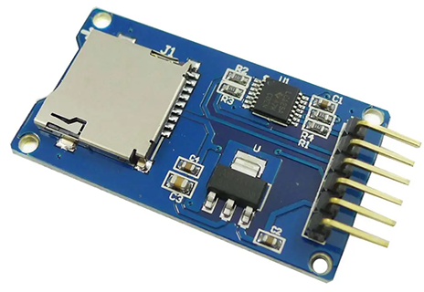
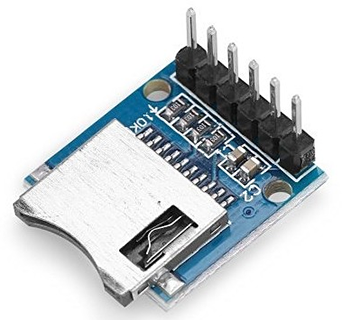
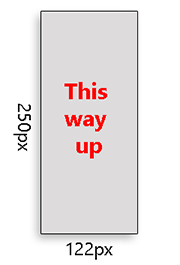

# Heltec E-ink Modules - SD Card

These methods allow reading and writing **.bmp images** from an SD / MicroSD card, using a cheap SPI adapter.

With level-shifter  |   Without level-shifter
--------------------|-------------------------
 | 

⚠ Depending on your adapter, and your Arduino, additional level-shifting circuitry may be required.

For more information, see: [wiring](/docs/README.md#wiring).

- [Limitations](#limitations)
- [Canvases (fullscreen .bmp)](#canvases-fullscreen-bmp)
  - [Pre-rendered](#pre-rendered)
  - [As a workspace](#as-a-workspace)
- [Using .bmp for drawing](#using-bmp-for-drawing)
- [Getting Info](#getting-info)


## Limitations

* Low speed
* Bigger sketches 
   * On Arduino Uno, >60% Flash used
* Higher RAM usage
* Not all methods available for Uno
    * `draw24BitBitmapFile()` consumes too much RAM
* Card format must be FAT or FAT32

## Canvases (fullscreen .bmp)

*Canvas* refers to a specific type of .bmp image.
* 24bit .bmp file
* Portrait, not landscape
* Dimensions: full screen width x height


Example: DEPG0290BNS75A | Example: QYEG0213RWS800
---|---
 | 

\* For displays QYEG0213RWS800, DEPG0213RWS800 and DEPG0213BNS800, a hardware quirk gives a canvas width of 128px, rather than the advertised 122px

### Pre-rendered
BMP files formatted in this way can be loaded efficiently onto the display:
```cpp
display.loadFullscreenBitmap("image.bmp");
```

### As a workspace 

#### Saving a canvas
Instead of drawing to display, the output can be directed into a canvas.

```cpp
DEPG0290BNS75A display(2, 4, 5);

void setup() {
    // Once, set CS pin
    display.useSD(7);

    SAVE_CANVAS (display, "test_canvas.bmp") {
        display.setCursor(20, 20);
        display.print("Hello, World!");
    }

}
```

If your microcontroller is powerful enough, you can skip the `SAVE_CANVAS` loop (similar to `update()`)

```cpp
DEPG0290BNS75A display(2, 4, 5);

void setup() {
    // Once, set CS pin
    display.useSD(7);

    display.setCursor(20, 20);
    display.print("Hello, World!");

    display.saveCanvas("test_canvas.bmp");
    
    // If you wish, you can also display the result without re-rendering
    // display.update();
}
```

`SAVE_CANVAS()` and `saveCanvas()` also accept integers, the same as `loadCanvas()` (above)

#### Loading a saved canvas

(This is the same as with [pre-rendered canvases](#pre-rendered))

```cpp
DEPG0290BNS75A display(2, 4, 5);

void setup() {
    // Once, set CS pin
    display.useSD(7);

    display.loadCanvas("test_canvas.bmp");
    
    // Another canvas:
    display.loadCanvas("canvas001.bmp");

    // Alternatively: special trick for "canavsxxx.bmp" files
    // display.loadCanvas(1);
}
```
`loadCanvas()` will also accept an integer <1000.<br />
`loadCanvas(001)` will load file `canvas001.bmp` from SD root.

## Using .bmp for drawing

Rather than immediately displaying a single .bmp file, you may want use the image as part of a complex drawing.

The most efficient option is to use "monochromatic bitmaps" (1-bit). These can be processed similarly to [XBitmaps](/docs/XBitmapTutorial/mono.md).

Much like XBitmaps, these are drawn as part of the normal drawing flow.

```cpp
DEPG0290BNS75A display(2, 4, 5);

void setup() {
    // Once, set CS pin
    display.useSD(7);

    DRAW (display) {
        display.drawMonoBitmapFile(0, 0, "mono.bmp", BLACK);
    }    
}
```

Another option is to draw "24bit bitmaps" (color).
This is much less efficient, but could be convenient when working with 3-Color displays.

```cpp
DEPG0290BNS75A display(2, 4, 5);

void setup() {
    // Once, set CS pin
    display.useSD(7);

    DRAW (display) {
        display.draw24bitBitmapFile(0, 0, "24bit.bmp");
    }    
}
```

## Getting Info

Several methods are provided to retrieve information about the SD card status and contents.

```cpp
DEPG0290BNS75A display(2, 4, 5);

void setup() {
    // Set CS pin
    display.useSD(7);

    // Check card connection
    if ( !display.SDCardFound() )
        return;

    // Check file
    if ( !display.SDFileExists("test.bmp" ))
        return;

    // Check if canvas is valid
    if ( !display.SDCanvasValid("test.bmp")) {
        // Do something?
    }


    // Check if canvas is valid, and delete if corrupt
    if ( display.SDCanvasValid("test.bmp", true) ) {
        // Do something?
    }

    int width = display.getBMPWidth("test.bmp");
    int height = display.getBMPHeight("test.bmp");
}
```
