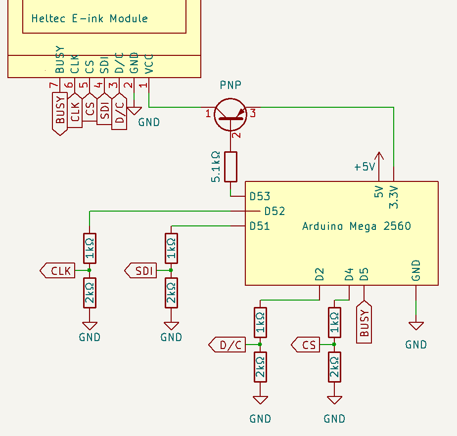
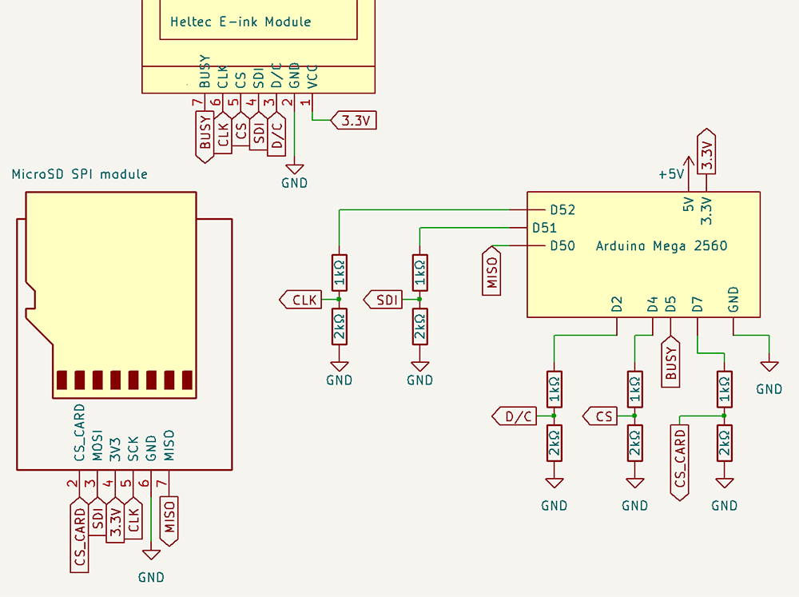

# Heltec E-ink Modules
## Wiring: ATmega2560

**❌ Connecting directly to display will cause damage**.


The ATmega2560 operates at 5V. The display operates at 3.3V. <br />
To connect safely, a "level-shifter" is needed.

Display | Arduino
--------|--------
 VCC    | 3.3V
 GND    | GND
 D/C    | D2 *
 SDI    | D51
 CS     | D4 *
 CLK    | D52
 BUSY   | D5 *

\* Can be changed. Set in constructor.

### Suggested wiring, with level shifting:


Note: The **BUSY** pin does not require level-shifting, as the ATmega2560 only reads this pin, never outputting 5V.

### (Optional) Suggested additional wiring, for power saving

```cpp
void setup() {
    // Pin 53, PNP transistor
    display.usePowerSwitching(53, PNP);

    //Later, when required:
    display.externalPowerOff();
    display.externalPowerOn();
}
```



### (Optional) Additional wiring: MicroSD card module
**⚠ Connecting directly to MicroSD module may cause damage.**

These Arduinos use 5V. MicroSD operates at 3.3V.<br />
Your MicroSD module *may* have an inbuilt level shifter. Many do not.

This diagram shows possible wiring for MicroSD modules which *do not* have an inbuilt level-shifter. Your may be able to connect directly.



❗ Take care when combining this wiring and `usePowerSwitching()`.<br /> `NPN` or `ACTIVE_LOW` configurations will damage the SD card. 

For greater protection, consider a *bidirectional level shifter*.