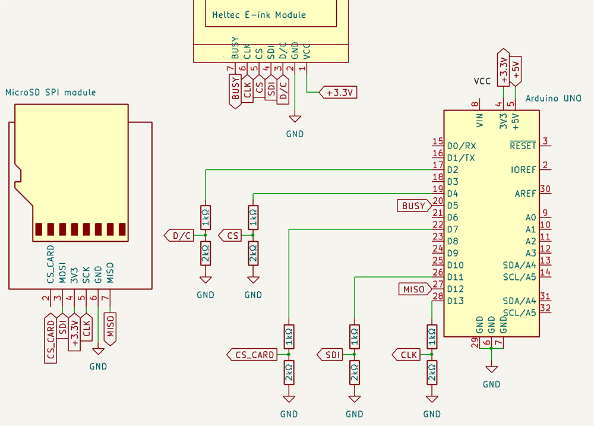

# Heltec E-ink Modules
## Wiring: Arduino Uno R3, Nano and other ATmega328P

**❌ Connecting directly to display will cause damage**.

These Arduinos operate at 5V. The display operates at 3.3V. <br />
To connect safely, a "level-shifter" is needed.

Display | Arduino
--------|--------
 VCC    | 3.3V
 GND    | GND
 D/C    | D2 *
 SDI    | D11
 CS     | D4 *
 CLK    | D13
 BUSY   | D5 *

\* Can be changed. Set in constructor.

### Suggested wiring, with level-shifting:


Note: The **BUSY** pin does not require level-shifting, as the Arduino only reads this pin, never outputting 5V.

### (Optional) Suggested additional wiring, for power saving

```cpp
void setup() {
    // Pin 7, PNP transistor
    display.useCustomPowerSwitch(7, PNP);

    //Later, when required:
    display.customPowerOff();
    display.customPowerOn();
}
```


### (Optional) Additional wiring: MicroSD card module
**⚠ Connecting directly to MicroSD module may cause damage.**

These Arduinos use 5V. MicroSD operates at 3.3V.<br />
Your MicroSD module *may* have an inbuilt level shifter. Many do not.

This diagram shows possible wiring for MicroSD modules which *do not* have an inbuilt level-shifter. You may be able to connect directly.



❗ Take care when combining this wiring and `useCustomPowerSwitch()` The `NPN` or `ACTIVE_LOW` configurations will damage the SD card. 

For greater protection, consider a *bidirectional level shifter*.