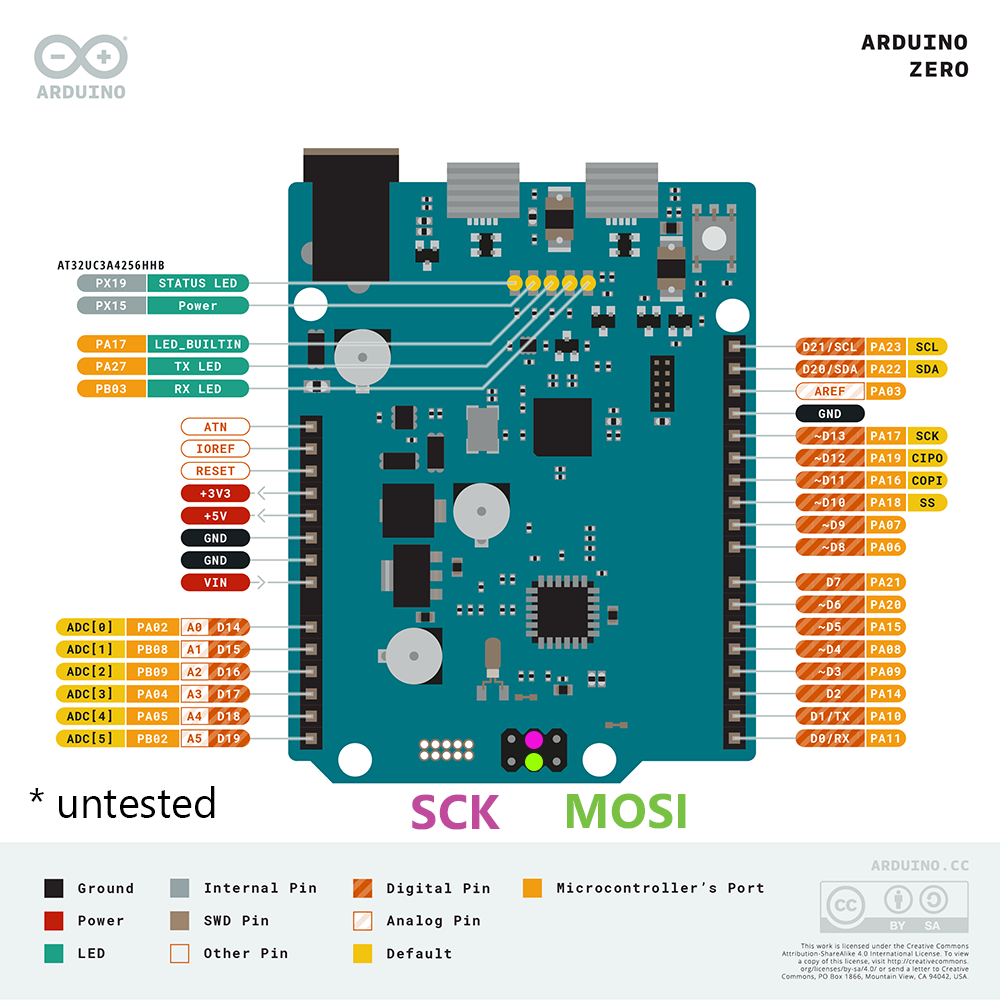
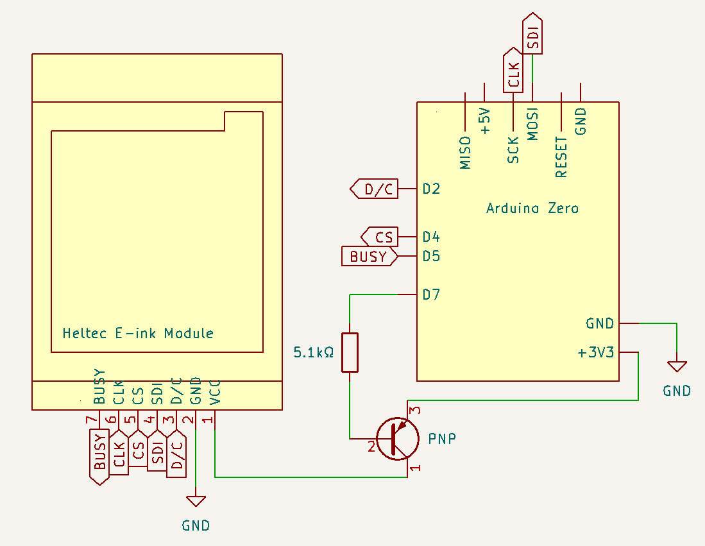

# Heltec E-ink Modules
## Wiring:SAMD21G18A

**✅ SAMD21G18A uses 3.3V logic. It can connect directly to display.**

Display | SAMD21G18A
--------|--------
 VCC    | 3.3V
 GND    | GND
 D/C    | D2
 SDI    | MOSI (COPI)
 CS     | D4
 CLK    | SCK
 BUSY   | D5


### Where are *MOSI* and *SCK*?
*Good question.* The location depends on your board.

These suggested locations are untested: I do not own either board. Please let me know if they do not work.

Arduino Zero | Arduino Nano 33 IoT
-------------|--------------------
 | 

### (Optional) Changing MOSI and SCK pins

All pin assignments can be changed, using an extended constructor:
```cpp
DISPLAY_CLASS(DC_PIN, CS_PIN, BUSY_PIN, SDI_PIN, CLK_PIN); 
```

Due to hardware limitations, only certain wiring pairs are valid for SDI and CLK:

SDI pin | SCK pin
--------|--------
 D2     | D5
 D4     | D3
 D4     | D5
 D5     | D3
 D10    | D12
 D11    | D12
 D11    | D13
 D12    | D13
 A1     | A2

 If your selection is invalid, your board's `LED_BUILTIN` will blink out an "SOS".

### (Optional) Suggested additional wiring, for power saving

```cpp
void setup() {
    // GPIO 7, PNP transistor
    display.usePowerSwitching(7, PNP);

    //Later, when required:
    display.externalPowerOff();
    display.externalPowerOn();
}
```

